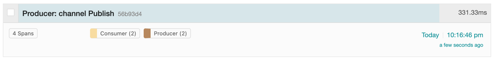

# Redis PubSub
Publish Subscribe Messaging In .NET with Redis Channels.  
Traces with OpenTelemetry.

## Goals
- [x] Build PubSub messaging under RedisMQ
- [x] OpenTelemetry distributed traces 

## Result
Jaeger contains propagated span with both producer and consumer activities  

## Environment setup
1. Run a redis on localhost with docker:  
`docker run -d -p 6379:6379 --name redis redis`
2. Run a jaeger on localhost with docker:  
`docker run -d --name jaeger \             
   -e COLLECTOR_ZIPKIN_HOST_PORT=:9411 \
   -e COLLECTOR_OTLP_ENABLED=true \
   -p 6831:6831/udp \
   -p 6832:6832/udp \
   -p 5778:5778 \
   -p 16686:16686 \
   -p 4317:4317 \
   -p 4318:4318 \
   -p 14250:14250 \
   -p 14268:14268 \
   -p 14269:14269 \
   -p 9411:9411 \
   jaegertracing/all-in-one:latest`
3. Traces are available on http://localhost:16686 endpoint

## Redis PubSub Theory
Messages sent by other clients to these channels will be pushed by Redis to all the subscribed clients.  

### Format of pushed messages
A message is an [array-reply](https://redis.io/topics/protocol#array-reply) with three elements.  

The first element is the kind of message:
- **`subscribe`**: means that we successfully subscribed to the channel given as the second element in the reply. The third argument represents the number of channels we are currently subscribed to.
- **`unsubscribe`**: means that we successfully unsubscribed from the channel given as second element in the reply. The third argument represents the number of channels we are currently subscribed to. When the last argument is zero, we are no longer subscribed to any channel, and the client can issue any kind of Redis command as we are outside the Pub/Sub state.
- **`message`**: it is a message received as result of a **`PUBLISH`** command issued by another client. The second element is the name of the originating channel, and the third argument is the actual message payload.

Pub/Sub has no relation to the key space. It was made to not interfere with it on any level, including database numbers.  
That means: publishing on db 10, will be heard by a subscriber on db 1.  

### Pattern-matching subscriptions

The Redis Pub/Sub implementation supports pattern matching. Clients may subscribe to glob-style patterns in order to receive all the messages sent to channel names matching a given pattern.  
**`PSUBSCRIBE news.*`**

### Pros & Cons:
- Real-time, low-latency, urgent messages
  - If messages are short-lived and age rapidly, so therefore are only relevant to subscribers for a short time window
- Unreliable delivery/lossy messaging
  - If it doesn’t matter if some messages are simply discarded due to unreliable delivery

### When to use
- A requirement for at-most-once delivery per subscriber
  - i.e. subscribers are not capable of detecting duplicate messages and target systems are not idempotent
- If subscribers have short-lived, evolving, or dynamic interest in channels, and only want to receive messages from specific channels for finite periods of time 
  - e.g. mobile IoT devices may only be intermittently connected, and only interested and able to respond to current messages at their location
